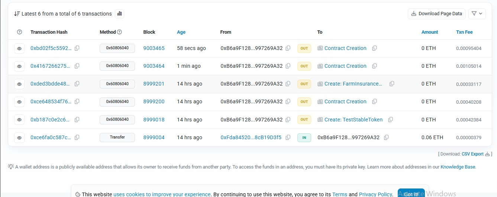

# 🌾 AI-Powered Farmer’s DAO  

An end-to-end decentralized insurance prototype that empowers farmers with **AI-driven risk predictions** and **blockchain-powered crop insurance**. This project integrates **Machine Learning models**, a **Flask backend**, a **React frontend**, and **Ethereum smart contracts (Sepolia testnet)** to ensure fair, transparent, and automated insurance payouts.  

---

## 🚀 Project Overview  

The system enables farmers to:  
- Register securely with government ID and MetaMask wallet.  
- Get **AI-based crop stress/risk predictions** using ML models.  
- Automatically **trigger insurance claims** on the blockchain when crop stress is detected.  
- Receive payouts transparently from a **decentralized insurance pool**.  

### Why This Project?  
Farmers often face delayed or unfair claim settlements. By combining **AI (for prediction)** and **blockchain (for trust & automation)**, we ensure farmers are fairly compensated when crop loss occurs.  

---

## 🏗️ System Architecture  

**1. Frontend (React + Web3 + Tailwind)**  
- Farmer dashboard for registration & login.  
- Upload documents (Aadhaar, selfie, ID).  
- MetaMask wallet integration for policy creation.  
- Claim status & payout tracking.  

**2. Backend (Flask + SQLite + ML Models)**  
- Handles farmer authentication & verification.  
- ML models (Decision Tree & Random Forest) trained on NDVI, rainfall, and stress datasets.  
- REST API endpoints:  
  - `/api/register` – farmer onboarding  
  - `/api/predict` – ML model risk prediction  
  - `/api/claim` – push claim to blockchain  

**3. AI/ML Engine**  
- Uses `StandardScaler`, DecisionTreeRegressor, RandomForestRegressor.  
- Predicts **crop stress** and **yield deviations**.  
- Output is scaled into **risk levels (0=Low, 1=Medium, 2=High)**.  

**4. Blockchain & Smart Contracts (Sepolia Testnet)**  
- **FarmInsurancePool.sol**: manages policies, premiums, and payouts.  
- **TestStableToken.sol**: ERC20 token acting as stable insurance currency.  
- Oracle submission via Flask (`web3_client.py`) → calls `submitOracleData`.  
- Payout executed **automatically** if stress level = 1 (stressed).  

---

## ⚙️ Tech Stack  

- **Frontend**: React.js, TailwindCSS, ethers.js, MetaMask  
- **Backend**: Flask, SQLAlchemy, SQLite, Flask-CORS  
- **AI/ML**: Scikit-learn, Pandas, NumPy  
- **Blockchain**: Solidity, Web3.py, Sepolia Testnet  
- **Deployment**: dotenv for secrets  

---

## 🔑 Smart Contract Functions  

- `createPolicy(farmer, insuredAmount, farmLocation, cropType, premiumAmount)`  
- `submitOracleData(policyId, stressLevel, payoutPercentage)`  
- `_executePayout(policyId, payoutPercentage)`  
- `fundPool(amount)`  
- `authorizeOracle(address)`  

---

## ⚡ Setup & Installation  

### Backend  
```bash
cd backend
python -m venv venv
source venv/bin/activate  # Windows: venv\Scripts\activate
pip install -r requirements.txt

# Create database
python recreate_db.py

# Run Flask API
python app.py
```

### Frontend
```bash
cd front
npm install
npm run dev
```

---

### 🔐 Environment Variables (.env)

```
FLASK_DEBUG=1
SECRET_KEY=super-secret-key
DATABASE_URL=sqlite:///db.sqlite3

SEPOLIA_RPC=https://eth-sepolia.g.alchemy.com/v2/<your-api-key>
PRIVATE_KEY=<your-private-key>
WALLET_ADDRESS=<your-wallet-address>
STABLE_TOKEN=<deployed-stable-token-address>
INSURANCE_POOL=<deployed-insurance-pool-address>
```

---

## 📊 Workflow

1. Farmer Registers → uploads Aadhaar + wallet.
2. ML Model Predicts → stress risk based on input data.
3. Claim Submitted → Flask sends oracle data to smart contract.
4. Smart Contract Executes → payout automatically if risk = stressed.
5. Farmer Receives Stable Token Payout.

---

## 🧾 Blockchain Transaction Proof

To ensure transparency, every insurance payout is recorded on-chain.  
Here's a sample transaction proof from the Sepolia testnet:





---

## 🧩 Future Enhancements

- Integrate real satellite NDVI + weather APIs.
- Use Chainlink Functions instead of direct oracle call.
- Build DAO governance for funders & farmers.
- Mobile app integration with offline-first support.

---

## 👥 Contributors

- Sivakumar B – AIML Engineer
- Anandavalli V - Web3 and Blockchain Developer
- Dhana Anjana S - Smart Contract Developer
- Aruna - Frontend Developer
- Jamunasree - Backend Developer

---
